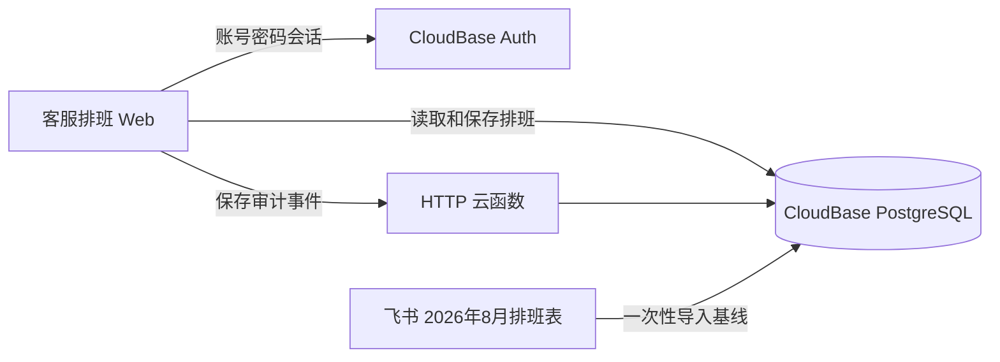

# 客服排班 SaaS 化设计

## 设计规格

- **目的**：让主管在一页内核对原始排班、集中调整、查看覆盖统计并追溯每一次保存。
- **视觉方向**：克制的运营控制台；浅暖灰工作区、白色数据面板、深墨文字，以珊瑚红作为唯一强调色。
- **色板**：墨黑 `#20242A`、暖白 `#F8F7F4`、边界灰 `#E7E4DE`、珊瑚 `#E85D4A`、早班青绿 `#DDF1EA`、中班琥珀 `#FDE9C9`、夜班深蓝 `#DCE8F7`、休息灰 `#EEF0F2`。
- **字体**：`Noto Sans SC` 作为正文、`Source Han Serif SC` 仅用于页面标题；数字采用等宽回退字体。
- **布局**：左侧固定导航（产品切换、月份）；顶部粘性工具栏（当前版本、编辑状态、保存）；主区为冻结姓名列的时间轴表；右侧或抽屉为统计与操作记录。

## 模块

## 数据与权限

- `schedule_workspaces` 保留为当前排班工作区快照，改为仅 `authenticated` 可读写。
- 新增 `schedule_baselines` 保存飞书源版本、原始行号与导入 JSON，保证可还原。
- 新增 `schedule_change_sets` 保存一次保存的版本、摘要和操作者 UID。
- 新增 `schedule_change_items` 保存逐格变更前后值。
- 新增 `schedule_audit_events` 保存时间、UID、用户名、请求来源 IP、User-Agent、设备摘要及关联版本。
- RLS：`authenticated` 仅可读取当前工作区；本期唯一账户 `mmll` 可写入。审计写入仅允许 HTTP 云函数服务端进行；浏览器无删改权限。
- 审计 IP 由云函数请求头中的代理转发地址提取，标记为“请求来源 IP”，可能是企业网关或代理地址。

## 登录与切换

- 使用 `auth.signInWithPassword({ username, password })`；登录态使用 `auth.getSession()`，不使用匿名登录或旧登录 API。
- 账号密码不写入代码、GitHub、PG 业务表或审计日志；账号由 CloudBase Auth 管理。
- 左上角提供“排班调整工作台 / 客服排班”切换。客服排班未登录时跳转登录页。

## 验证

- 浏览器：错误密码拒绝、正确账号进入、8 月源数据逐格比对、集中改班、保存、刷新回读、审计记录显示。
- 数据库：基线、工作区、变更集、变更项和审计事件均可回读；RLS 拒绝匿名读写。
- 发布：静态构建成功、线上根域名可打开、深链入口可访问。
